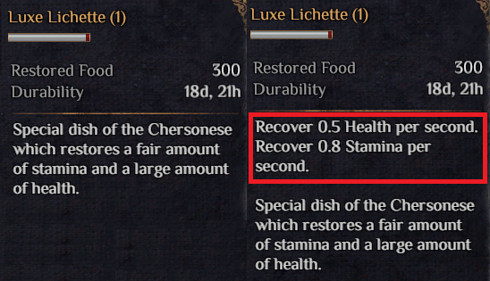

# More Status
MoreStatus display stamina recovery rate and health recovery rate on food items.

          
## Installation
You need to be on **“default-mono”** Branch:

* On Steam: Right-click Outward in Steam library, and select Properties > Betas > “default-mono – Public default branch(mono)

* Install [BepInEx](https://outward.thunderstore.io/package/BepInEx/BepInExPack_Outward/) and [Outward SideLoader](https://outward.thunderstore.io/package/sinai-dev/SideLoader/)

* Download “MoreStatus.rar” 

* Extract to a new folder, then navigate to **“Outward\Outward_Defed\BepInEx\plugins”** and move the new folder there.

## Contribution

Feel free to update any new features to this mod

## Support
If you need further help installing the mod, check on [Outward wiki](https://outward.fandom.com/wiki/Installing_Mods) or send me a message!

## Credits

Thanks to **Sinai** for making the template, and **Ehaugw** for the help.
